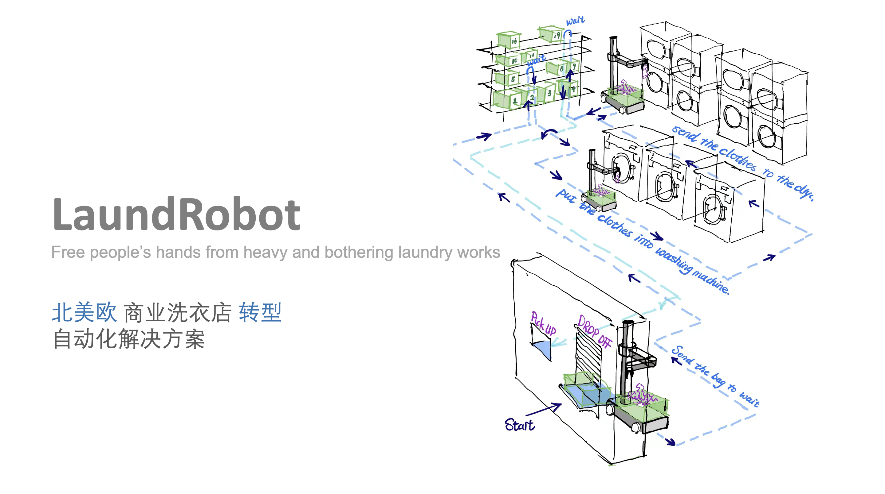

## Mission
我们期待我们创造的叠衣机，能够像洗衣机烘干机一样成为家庭清洗 “三大件”。

## 问题

我们聚焦：商业洗衣店 ***转型*** 和 ***人工成本*** 矛盾 的问题

商业洗衣房（非干洗店）的兴起，源于洗衣机的发明和普及晚于欧美居住大楼的建设。住房的逐步更新，配备了完善的家庭洗烘设备，让传统商业洗衣店的客户规模缩水，以至于不得不寻求行业转型。

近6成的商业洗衣店转型服务 - 提供额外的 ‘叠送’ 衣服务 - 来转换服务的人群，提高客单价。***但是接近15%营业额的人力成本让他们无法扩大更多的用户群体，后疫情时代招工的 - 不确定性 - 让人力成本和业务转型的矛盾更加的激化。*** 我们认为目前解决方案和需求的矛盾，让这个赛道迎来了变革的机会。

## 解决方案

我们认为 ***矛盾*** 的原因来自 1 不稳定和昂贵的人力 2 客户参与操作带来的混乱：

- 人力成本
  - 22年后丰厚的社会福利，导致了全美普遍的用工荒 -> 人工贵变成了人工不稳定，经常停止接受新订单或停业。
  - 南美移民劳工难以提供长期一致的服务 - 重复劳动的叠衣过程中衣服丢失、不同顾客的错放、深浅衣服的混洗和非标准服务带来用户的负面评价。

- 流程混乱
  - 运营人力昂贵 - 第三方顾客对店内设施的滥用，如洗鞋、卫生间偷盗，顾客撬开洗衣机收银槽进行破坏和偷盗，每日多次对洗衣店的人工清洁。
  - 客户行为不可预测 - 客户过载，不恰当的洗衣溶剂添加，错误的操作温度弄坏机器，细病菌的交叉感染带来的额外开销。

> [!Note]
> 我们的解决方案是：*本地劳动力* 转移到 *远程劳动力* 迁移到 *机器劳动力*

劳动力转移带来的 ***降本***
- 全自动洗衣避免了流程混乱，减少人工监督和处理问题工时：多个全职洗衣员工 -> 单个兼职机器运维
- 劳动力的转移使叠衣的成本降低了约 $0.25/bl，平均每个月节省$1400 美金的人力成本。

劳动力转移带来的 ***增效***
- 更低的折叠成本可以拓宽用户群，做大市场规模 -> 原来 $100 美金洗烘叠送包月，现在 $30 包月，付费用户群++
- 全自动洗衣提供的不等待服务提高体验的同时可以提高客单价

## 产品

我们创造了两台机器来实现全自动服务的洗衣店：

- 转移机器：接收、转移和分发需要清洗的衣物
- 叠衣机器：折叠清洗烘干完成的衣物

用户将需要清洗的衣服留在店门的交割货架，店内的转移机器可以将交割货架中的衣服放进洗衣机，完成洗衣后机器把衣物放入烘干机，烘干完成后放入叠衣机器，完成后转移至货架上，RaaS 系统向用户推送服务完成的通知，用户到店时将衣物转移至交割货架供用户取货。

### Laundrobot 技术路线

我们目前实现了初步的原型机，下面从感知、决策和执行三个层面简单阐述可落地的 ***叠衣*** 技术解决方案：

- 执行层面：寻找最小可行的机构：人可以叠，猴子可以叠，猫狗不可以叠 -> 四肢有末端执行器 -> 单手掌+手臂 可以叠 -> 至多7自由度就可以实现 -> Raw轴和 补偿轴可以被替代 -> 5轴运动平台可以实现 -> 3D打印机运动平台+云台。

- 感知层面：中距 ToF 的3D感知商业解决方案比较完善，我们用 iphone 的零部件就可以实现人类可识别的三位模型重建 - 让远程操控者可以清晰获得衣服的三维信息。

- 决策层面：我们通过远程人工去操作叠衣自建海量的数据集，在训练模型和迭代的同时获得相等的应的商业回报、构筑数据壁垒。

## 市场规模 & 成本

我们计算了北美市场理论上限 TAM 与可立即获得市场 SAM，以及论述市场可以从 SAM 向 TAM 扩展的驱动原因。

- **理论上限 TAM 200亿 美金/年**

计算依据：依据行业协会统计数据，目前年收入超过 $150k+ 的家庭是洗烘叠送服务的主流消费人群，全美有20万户年收入超过15w美元的家庭，目前他们每月平均花费 $100 在衣服的洗烘叠送服务上。

> 20M High Revenue Family * $100 per month * 12month = $24B/year

- **可获得市场 SOM 60亿 美金/年**

> 行业数据：北美每年花费 60亿美金 在 ToC 商业洗衣店（不包括干洗）

- **可立即获得市场 SAM 7亿 美金/年**

计算依据： 商业洗衣店的数 * 销售/订阅客单价来计算赛道的规模：约7亿美元/年 + 1.5亿美元的销售天花板

> Renew & Sale: 30k laundry stores world wide * $5k per store  = $0.15B one time pay
>
>Subscribe: 30k * 12 months * $2000 per month  = $0.72B/year

19年来商业洗衣店的总数量缩小，但行业整体的收入稳定在 $6B 并在23年有0.1%的增长。

调查发现：自助洗衣的数量减少所带来的收入下降，由转型洗烘叠送服务的商家的收入增长所弥补，同时只负责叠衣的中间商开始逐渐兴起，这个现象表明叠送需求并没有被释放，类似大型移动电源市场的规模的扩大，是 ***供给端的技术进步，带来了需求端的增长。***

## 商业模式
### 付费模式

租赁+订阅+按需付费 的模式实现营收：商户向我们订阅设备，付取一次性安装和运输费用后，按用量收取租赁费用，以及每月一定的固定费用。

估算我们在单家店铺的年收入约为：$24000 美元/年/店，此数据来自于：

向我们支付的费用：
1. 一次性的租赁安装和运输 $1000；
2. 订阅(运维和保险) $300/月[1]；
3. 折叠费用：$0.3/lb。

依据调查 目标用户 [2] 每月平均折叠衣服的平均数量是 6300lb [3]，计算得出店主每月花费 2000 美元在租赁我们的服务上。目前的本地平均人工费用 $15/h [4] ，单个人工平均每小时折叠 30lb [5]，本地人工折叠的单价约为 $0.5/lb，高于我们提供的 $0.3/lb 的价格，可以为店主获得约每月 $1400 额外的收益。

> [!Note]
> 以上数据来源于 FB Group 统计，使用保守的中位数进行计算。
>
>[1] 服务纽约和洛杉矶地区的宕机上门维修，更换零配件的保险价格
>
> [2] 目标用户：提供洗烘叠送服务的洗衣店，统计数据得到占所有洗衣店约六成
>
> [3] 依据目标用户提供的数据，我们计算的保守平均每日每店约100kg的订单。
>
> [4]目标用户主要分部州最低时薪资 $14 - $18.5，此处按照 $15 计算
>
> [5] 不同衣物所花费的人力不同 30lb/h 是主流认同的最低标准

### 扩张模式

我们目前在 Facebook 上建立了自己的 ***天使用户*** 小组，我们已经和9位用户达成了部署意向，他们是我们在 其他 FB洗衣店小组中吸引过来的客户，还有另外16位用户关注了我们的动态，我们率先在他们的店铺进行 PMF 打磨。

我们的 ***早期客户*** 来自于区域的饥饿营销，我们将一个服务区域内（如3mile 内）的聚类成为一个组，三个月内一个组内只为一家洗衣店提供服务，当我们降低该店的运营成本对组内其他店铺形成营收压力之后，促进小组内其他店主动购买我们的服务。

## 最新进展简报 & MVP

- 4.1 - 我们实现了 Demo 手动的技术可行性论证，以及完成机械搭建，进入编码测试阶段
- 3.14 - 我们获得了 505 Stockton Ave, San Francisco, CA 94015 公寓一楼洗衣房的部署测试许可
- 3.7 - 我们创建了我们自己的 FB 小组 Future Laundromat 获得了40+ 洗衣店主的订阅

[详细的最新 Update](https://ow7c26ph63.feishu.cn/docx/CLD1d8lsnoyRD3xzSh6cOMVdnFe)

## 竞争

这个赛道上主要的竞争对手是 [Laundroid](https://www.failory.com/cemetery/seven-dreamers-laboratories) 和 [Fodimate](https://www.seedinvest.com/foldimate/bridge)

- Laundriod 是日本松下电器投资的机器人公司，共计融资9500万美金，他们的产品是全自动的叠衣衣柜，使用类机械臂+多传感器融合的技术方案，使用传统方法+神经网络的决策模型来折叠衣物，一件衣服平均花费20min，其在CES2018上亮相。Laudriod 选择 ToC 的技术路线的不收敛，导致价格和产品效果不匹配最后破产。

- Fodimate 是一家硅谷的机器人初创公司，共计融资670万美金，近1万台的预付费，定位 ToC 或 ToB 的半自助叠衣机，用户需要将衣领或裤腰带送进机器，机器会自动化完成后续工作，机器只能处理标准的衣服和裤子，对于鞋袜厚重衣物等无能为力。其在CES2018上亮相。Fodimate 技术路线收敛的范围过小，导致产品功能与用户期待不匹配最后破产。

## 认知和观点

人形机器人赛道方兴未艾，无论是 ***通用人形*** 还是 ***专用专型***，我们认为核心是优质的底层数据，就像 ChatGPT 效果优于 VisualGPT，我们认为这个赛道核心的竞争壁垒是 - 优先获得和占有 ***优质*** 的数据。

### 技术发展路径

***通用*** 人工智能机器人如同实现非条件反射任务（实现登顶珠峰）， ***分段*** 人工智能机器人就如同构筑条件反射任务（行走、跳跃、攀爬、速降）。

我们认为AI机器人的落地应该是 ***“先分段再通用”***。就像人类掌握技能的路径：呼吸-走路-说话-认知-记忆-逻辑-学习.. 是在训练不同的专有神经网络构成条件反射，然后再是宏大的通用神经网络去控制条件反射.

我们认为单一任务的分段AI，应该是商业落地的第一步，所以我们推论最可能热与机器人的未来是：一个通用智能如 ChatGPT，控制多个专用智能执行器。

### 技术商业化路径

我们认为AI类机器人技术的门槛高、鲁棒性差，如同计算机发明初期的大型机，专供需求单一稳定的科研界使用，当技术平台收敛之后，个人电脑迎来广阔的发展，如果顺序颠倒可能会是一个严重的商用灾难。依据技术文明的迭代经验，我们认为智能机器人的商业落地，也会是一条类似的路线，即从 ***B端入手，技术收敛过度到服务C端*** ，所以我们选择从 B端 入手，期望成为机器人赛道的IBM。

### 赛道认知
>我们认为解决问题的最终目的 是保护 Buiness Owner 的投资。

“省心比省钱更重要” BO 投资洗衣店的目的是获得稳定且轻松的收益，但是 ***‘you leave your hands, business leave you ’*** ，尽管降本增效是 ToB 业务的核心，但是对于 BO 个体类型的商业客户也是独立的个体，在降本增效之外，减少他们在商业洗衣店中花费的时间和精力，让他们圆梦 ***“hands off”*** business 是更重要的客户价值。

## 团队

### 成员

***CEO*** [黎鹏宇](http://www.pengyulee.com/)
技术型连续创业者，两次获得李泽湘老师旗下孵化器投资，DJI Eng; UChicago HCI & 天大

***VP Eng*** [邱迪聪](http://www.davidqiu.com/)
PIX Moving VP, Ruqi Mobility Director, ISEE Sr. Eng, NASA RI, DJI Eng；CMU & 中山

***VP Sys*** [臧宇航](https://yuhangzang.github.io/)
视觉和AI算法专家，DJI Eng, 商汤科技 Eng, OpenImage 第一名；NTU Ph.D & 电子科大

### 创业动机
Li：对于我个人来说，我想 “To be somebody” 。我很难忍受无聊领导的领导以及僵化组织的束缚。从大一退出论资排辈科技工作室，出来和一帮大一和大四的同学创建了自己的工作室参加世界机器人竞技，作为创始队长在一年内带领队伍掌握全部技术栈，两年打进国赛，三年成为了种子队伍成为近百人的大团队。后来在李泽湘老师的帮助下，误入了创业道路，很困难但是活着有盼头，是可以一件可以 quit 掉 PhD 来做的事。

Qiu：我觉得我自己并不是一个甘于稳定的人，一直想弄点大的动静，在 CMU 毕之后我觉得自己并不 ready 去创业，所以选择一条学习曲率最陡的 - 去加入科技初创公司，我在几家自动驾驶担任了技术 leader，也积极参加创业社区也是鹏宇在奇绩组织的活动中我们很惊喜额外的找到了一个我们两个一直都想做的事情，所以我们一起出来做这个赛道。

### 人生偶像 & 价值感
Li：创业圈很多人的偶像是 Elon, 我觉得偶像是自己欠缺部分的长板在偶像身上的弥补，我觉得我能成为 Elon 这样的人，所以更多的是在大脑中开一个 Elon 的副本，遇到抉择时候能够跳出自我的偏见，想想如果 Elon 遇到这个问题会怎么做，做出相对正确的抉择。我的偶像是 [Craig Federighi](https://www.apple.com/leadership/craig-federighi/) - Apple 软件 SVP，喜欢他也很简单：作为管理层，上能深刻提炼需求转为系统架构，下能够帮实习生改功能代码，对软件系统深刻的理解和绝对掌控能力，是我非常非常崇拜的。

Qiu：

## 财务与融资
> 在种子轮阶段，我们期望用 6% 的股权融资 300万 人民币，用于实现团队 6个月 的目标.

我们期望6个月的时间内，实现 ***100个*** 客户单位的销售订单和 ***30个*** 客户单位的部署，以及 ***10万美元*** 的营收。在融资后，我们计划在 第3个月 完成需求收敛和可销售产品的研发，第5个月前实现30单位的销售、部署的预热以及产品的修正，第6个月 前完成100单位的早期用户的销售。

---

#### 人力成本 ¥72万
为了达成这个目标，在员工层面，我们计划招募约2～3位员工，派驻1位成员前往加州和纽约州2个月，实现签单和部署.

> 创始团队*3人* 1.5w/月 + 在华员工 2人*2.5w/月*6月 + 在美员工 1人*3w/月*6月 = ¥72万
>
>在华员工包括了 嵌入式工程师*1 项目管理*1；在美员工包括了 市场营销*1

#### 研发成本 ¥80万
我们计划造出 30 台可部署的原型机，每台机器成本不超过 ¥1w ；在研发层面规划三次主要的机器迭代过程每次花销不超过 ¥5w；初期的运输和部署费用我们预计在 ¥6k/台，包括了海运、陆运、组装、测试和其他意外情况。

#### 营销成本 ¥120万
我们从现有的商业洗衣机经销商和区域维修工入手，我们派遣一位员工前往纽约州和我们已经招募的市场营销人员进行为期2个月的运营测试和保障。

– 关于天使轮 –
如果直接从天使轮开始融资，我们计划使用 12% 股份融资 1000万人民币，在 15个月 的周期内实现 1000单位 的销售和部署，实现 400万美元 的营收。
